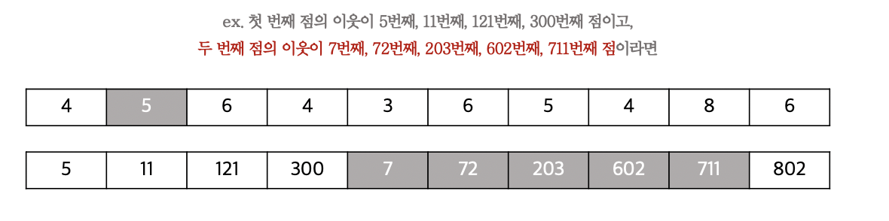

# 3D Unsharp Masking for Scene Coherent Enhancement

'3D Unsharp Masking for Scene Coherent Enhancement' 논문을 읽고, 구현하는 프로젝트

- [x]  Prototype (논문 내용 구현)
- [ ]  개선 과제 진행중

---

# Summary

### 목표

- 영상의 대비를 향상시키는 기존의 접근방식인 2D unsharp mask 기법을 지역정보를 활용한 3D 방식으로 개선시키는 것

### Stack

- OpenGL
- C++
- GLSL

### 기간

- 2021.07 ~ 2021.09

    → 프로토타입

- 2020.09.02 ~ ing

    → **개선 과제 진행중**

---

# 프로토타입 최종 산출물

**원본 3D object 렌더링의 대비 향상**

.png)

stanford bunny : face 개수가 적은 모델 / (좌)전, (우)후

.png)

stanford bunny : face 개수가 많은 모델 / (좌)전, (우)후


stanford bunny : face 개수가 적은 모델 → lambda 향상값에 따른 변화


stanford armadillo → lambda 향상값에 따른 변화

**2D Unsharp mask 기법의 부작용 해결**

→ 3D object에 대한 geometric한 정보를 담고 있지 않기 때문에 이미 조명에 의해 detail이 뜨는 이미지에 대해서는 대비를 향상시킬 수 없는 문제가 있으며, 배경과 3D object들 간의 경계를 판단할 수 없으므로 halo effect 현상이 발생합니다.


# 사전 지식

### 2D Unsharp Mask 기법과의 비교

우선, 기존의 2D Unsharp Mask 기법은 다음과 같은 순서로 적용됩니다.

1. 원본 이미지의 모든 픽셀에 대해 각 이웃에 대해 흐림 효과를 적용한 이미지를 구합니다.
    1. 이 때, 가장 일반적인 방법으로 흐림 효과는 **각 픽셀을 중심으로 흐림 효과를 적용하고자 하는 커널의 사이즈만큼의 범위에 해당하는 이웃한 픽셀들의 밝기를 모두 평균 내어 계산**합니다.
2. 원본 이미지와 흐림 효과를 적용한 이미지의 차를 구해, 원본 이미지의 detail을 나타내는 mask 이미지를 구해낼 수 있습니다.
3. detail을 나타내는 mask 이미지와 원본 이미지의 합을 구합니다.
4. 이미지의 명암 대비가 향상됩니다.

    

    2D Unsharp Masking 기법의 간단한 요약 (원본 + detail = 대비 향상)

### 텍스처를 이용한 한계 극복 기법

**Shader를 사용하면 병렬 프로그래밍의 이점을 얻을 수 있게 됩니다.**

하지만, 병렬 프로그래밍의 특성상 한 번에 여러 점을 처리하게 되기 때문에 CPU 프로그래밍에서 사용하던 일반적인 접근법들을 사용할 수 없게 되므로 **한 번에 여러 인덱스의 점에 대한 정보를 가져오거나 배열의 특정한 인덱스에 직접적으로 접근하는 방법을 이용해야 하는 경우, 텍스처를 사용함으로써 한계를 극복할 수 있습니다**.

### 이웃한 점들을 판단하는 기준 | 1-ring neighborhood

3D 접근법은 2D 접근법에 비해 이미지 단위로 접근하지 않으므로, 픽셀이라는 개념이 존재하지 않습니다.


1-ring neighborhood

→ 그러므로 점의 이웃에 대해서 접근하기 위해 점과 edge를 공유하는 점들을 이웃한 점으로 판단하는 '1-ring neighborhood' 개념을 사용합니다.

# 구현 내용 및 설명

### 각 점의 1-ring neighborhood 찾기

1-ring neighborhood는 edge를 공유한 점들의 집합이지만 **obj의 face table에 접근할 때, face를 구성하는 세 점의 인덱스를 받아오며 한 번에 구성**할 수 있었습니다.

단, **중복한 인덱스의 이웃이 들어오지 않도록 주의하며** 코드를 짜야 합니다.

```cpp
static std::map <std::pair<int, int>, int> checkOverlap;
...
// 함수 내부
// 1-ring neighborhood를 위한 인접 리스트 구성
int tempVer0 = vertexIndex[0], tempVer1 = vertexIndex[1], tempVer2 = vertexIndex[2];
// 아직 체크되지 않은 정점 관계라면 push_back();
if (checkOverlap[{tempVer0, tempVer1}] == 0 && checkOverlap[{tempVer1, tempVer0}] == 0)
{
    checkOverlap[{tempVer0, tempVer1}] = 1;
    checkOverlap[{tempVer1, tempVer0}] = 1;
    adjNeighborList[vertexIndex[0]].push_back(vertexIndex[1]);
    adjNeighborList[vertexIndex[1]].push_back(vertexIndex[0]);
}
...
// 0, 2번째 점의 관계와 1, 2번째 점의 관계에 대해서도 같은 과정 진행
```

### 1-ring neighborhood의 평균의 밝기를 이용해서 대비 향상시키기


프로토타입에서 사용한 텍스처 목록들 (new는 논문에서 언급하고 있지 않던 텍스처들)

1. CPU에서 다음 텍스처 목록들을 구성하여 Shader로 내보냅니다.
    1. 각 점에 대한 이웃의 개수가 저장된 텍스처
        1. 각 점들에 대한 이웃의 개수가 순차적으로 저장된 텍스처입니다.
        2. **이웃의 인덱스가 순차적으로 저장된 텍스처에서 몇 개의 인덱스에 대해 접근해야 하는지에 대한 정보를 얻어오기 위해 필요**합니다.
    2. 각 점에 대한 이전 점들의 이웃들의 **누적 개수가 저장된** 텍스처
        1. **이웃의 인덱스가 순차적으로 저장된 텍스처에서 몇 번째 인덱스부터 접근해야 하는지에 대한 정보를 얻어오기 위해 필요**합니다.
    3. 이웃한 점들의 인덱스가 순차적으로 저장된 텍스처
        1. 0번째 점부터 시작하여, 이웃한 점들의 인덱스가 순차적으로 저장된 텍스처입니다.
        2. 각 점에 대한 이웃의 개수가 저장된 텍스처와, 누적 개수가 저장된 텍스처와 혼합해 다음과 같은 방식으로 접근하게 됩니다.

            

    4. 각 점에 대한 normal이 저장된 텍스처 | 혹은 Normal Buffer로 넘겨주는 방식으로도 접근 가능
        1. 1-ring neighborhood 개념을 사용하고 있으므로, 점의 인덱스는 점의 위치로 구분되어야 합니다.
        2. 이 때, **이웃한 점의 normal vector로 계산되는 illumination color에 접근하기 위해 점의 위치 : 점의 normal vector는 1:1 대응이 되어야 합니다**.
        3. 한 점의 위치당 normal이 1:1 관계로 대응되지 않는 obj의 경우

            → 점의 위치를 호출하는 면의 normal vector들을 모두 합산하여 평균을 낸 normal vector를 적용하는 방법을 사용했습니다.

2. Vertex Shader
    1. 전달받은 텍스처들로 한 점의 각 1-ring neighborhood에 대한 인덱스를 읽어옵니다.
    2. 읽어 온 인덱스에 해당하는 점의 normal vector를 읽어온 후, illumination color를 계산합니다.
        1. 이 때, 누적한 점들의 이웃의 개수와 이웃한 점의 개수를 통해 반복문을 진행하여 평균을 낼 수 있도록 합산합니다.
    3. 이웃한 점들의 개수로 나눠 평균을 구합니다.
    4. 현재 점의 normal vector를 통해 현재 점에 해당하는 illumination color를 계산한 후, 평균과 차를 구합니다.
    5. 계산한 차와 현재 점의 illumination color를 합산하여 색을 계산합니다.
    6. 계산한 색을 벡터 형태로 fragment shader로 내보냅니다.
    7. 위 과정을 모든 점들에 대해 반복합니다.

    ```glsl
    #version 330 core
    ...
    out vec3 unsharpVector;

    uniform isampler2D neighborNum;
    uniform isampler2D neighborIdxList;
    uniform sampler2D vertexNormalTex;
    uniform isampler2D accumNeighborNum;

    uniform float TEXTURESIZE_FLOAT = 1024.0;

    void main()
    {
    		...
    		// *** 1-ring neighborhood 인덱스 접근
        float colIdx = gl_VertexID/TEXTURESIZE_FLOAT;
        float quotient = floor(colIdx);
        float rowIdx = quotient/TEXTURESIZE_FLOAT;
        colIdx -= quotient;

        int currentNeighborNum = texture(neighborNum, vec2(colIdx, rowIdx)).r;
        int startVertexIdx = texture(accumNeighborNum, vec2(colIdx, rowIdx)).r;
        int endVertexIdx = startVertexIdx + currentNeighborNum;

        // illumination color 계산을 위한 변수들
        vec3 avgIntensity = vec3(0, 0, 0);
        vec3 LightColor = vec3(1,1,1);
        float LightPower = 30.0f;
        vec3 MaterialDiffuseColor = vec3(diffuseColor);
        vec3 ModifiedAmbientColor = clamp(ambientColor, 0.1, 1.0) * MaterialDiffuseColor;

        vec3 l = normalize(LightDirection_cameraspace);
        vec3 E = normalize(EyeDirection_cameraspace);
        float distance = length( LightPosition_worldspace - Position_worldspace );    

    		// *** 현재 점과 이웃한 점들에 대해 접근
        for (int i = startVertexIdx; i < endVertexIdx; i++)
        {
            unsharpVector = vec3(1, 1, 1);
            // 현재 vertex의 이웃에 순차적으로 접근
            float i_float = float(i);
            float neighborColIdx = i_float/TEXTURESIZE_FLOAT;
            float neighborQuotient = floor(neighborColIdx);
            float neighborRowIdx = neighborQuotient/TEXTURESIZE_FLOAT;
            float currentNeighborIdx = texture(neighborIdxList, vec2(neighborColIdx, neighborRowIdx)).r;

            // 이웃의 normal 가져오기
            float neighborNormalColIdx = currentNeighborIdx/TEXTURESIZE_FLOAT;
            float neighborNormalQuotient = floor(neighborNormalColIdx);
            float neighborNormalRowIdx = neighborNormalQuotient/TEXTURESIZE_FLOAT;
            neighborNormalColIdx -= neighborNormalQuotient;
            vec3 neighborNormal = texture(vertexNormalTex, vec2(neighborNormalColIdx, neighborNormalRowIdx)).rgb;

            // 이웃들의 illumination color 계산
            vec3 neighborNormal_cameraspace = ( V * M * vec4(neighborNormal,0)).xyz;
            vec3 n = normalize(neighborNormal_cameraspace);
            vec3 R = reflect (-l, n);
            float cosAlpha = clamp( dot( E,R ), 0,1 );
            float cosTheta = clamp( dot( n,l), 0,1 );

            vec3 illuminationColor = ModifiedAmbientColor + MaterialDiffuseColor * LightColor * LightPower * cosTheta / (distance*distance) + specularColor * LightColor * LightPower * pow(cosAlpha,5) / (distance*distance);
            avgIntensity = avgIntensity + illuminationColor;
        }

        float neighborNum_float = float(currentNeighborNum);
        avgIntensity /= neighborNum_float;

        // *** 현재 vertex의 illumination color 계산
        vec3 currentNormal = texture(vertexNormalTex, vec2(colIdx, rowIdx)).rgb;
        vec3 currentNormal_cameraspace = ( V * M * vec4(currentNormal, 0)).xyz;
        vec3 n = normalize(currentNormal_cameraspace);
        vec3 R = reflect (-l, n);
        float cosAlpha = clamp( dot( E,R ), 0,1 );
        float cosTheta = clamp( dot( n,l), 0,1 );

        vec3 currentColor = ModifiedAmbientColor + MaterialDiffuseColor * LightColor * LightPower * cosTheta / (distance*distance) + specularColor * LightColor * LightPower * pow(cosAlpha,5) / (distance*distance);

        // *** 평균과의 차 구하고, 내보내기
        unsharpVector = currentColor - avgIntensity;
        unsharpVector += currentColor;
    }
    ```

3. fragment shader
    1. vertex shader에서 전달받은 벡터를 색으로 내보냅니다.

    ```glsl
    #version 330 core

    in vec3 unsharpVector;
    out vec4 color;

    void main()
    {
        color = vec4(unsharpVector, 1);
    }
    ```

---